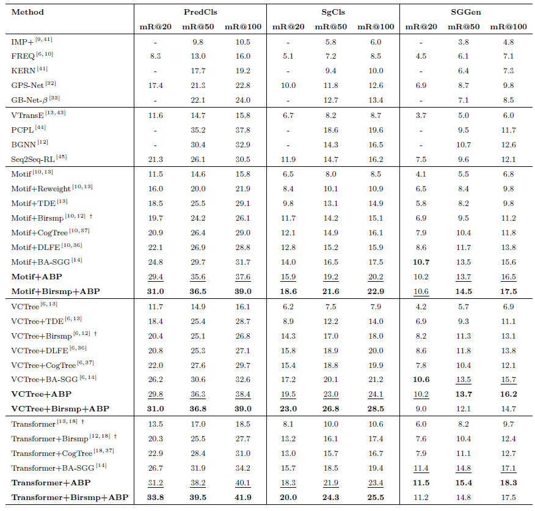

# Balanced Scene Graph Generation Assisted by Additional Biased Predictor


[](https://www.python.org/)


This repository includes the Pytorch code for our paper [Balanced Scene Graph Generation Assisted by Additional Biased Predictor](xxx) has been accepted by [SCIENTIA SINICA Informationis](https://www.sciengine.com/SSI/home) (in Chinese). 


## Overview

Scene graph generation has suffered from the bias brought by the long-tailed distribution among the relationships. The scene graph generator prefers to predict the head predicates which are ambiguous and less precise. It makes the scene graph convey less information and degenerate into the stacking of objects, which restricts other applications from reasoning on the graph. In order to make the generator predict more diverse relationships and give a precise scene graph, we propose a method called Additional Biased Predictor (ABP) assisted balanced learning. It introduces an extra relationship prediction branch which is especially affected by the bias to make the generator pay more attention on tail predicates rather than tail ones. Compared to the scene graph generator which predicts relationships between any object pairs of interest, the biased branch predicts the relationships in the image without being assigned a certain object pair of interest, which is more concise.  In order to train this biased branch, we construct the region-level relationship annotation using the instance-level relationship annotation automatically.  Extensive experiments on the popular datasets, i.e., Visual Genome, VRD and OpenImages, show that ABP is effective on different scene graph generator, and makes the generator predict more diverse and accurate relationships and provide a more balanced and practical scene graph.


### Main results

- Confusion matrix comparsion between Motif, TDE, and our ABP.


- Performances on Visual Genome.

  

## Installation

Check [INSTALL.md](INSTALL.md) for installation instructions.


## Dataset

Check [DATASET.md](DATASET.md) for instructions of dataset preprocessing.


## Metrics
Explanation of metrics in our toolkit and reported results are given in [METRICS.md](METRICS.md)


## Pretrained Object Detector

We use the pretrained Faster R-CNN from  [Scene-Graph-Benchmark](https://onedrive.live.com/embed?cid=22376FFAD72C4B64&resid=22376FFAD72C4B64%21779870&authkey=AH5CPVb9g5E67iQ) for comparisons on Visual Genome dataset. You can download it and place it under `pretrained_faster_rcnn`.

For OpenImages, we use the pretrained Faster R-CNN from [PySGG](https://shanghaitecheducn-my.sharepoint.com/:u:/g/personal/lirj2_shanghaitech_edu_cn/EfGXxc9byEtEnYFwd0xdlYEBcUuFXBjYxNUXVGkgc-jkfQ?e=lSlqnz).

For VRD, you can download our pretrained [Faster R-CNN](https://drive.google.com/file/d/1VBpP57OErLejclTii2wOJz-ufF42FIU-/view?usp=sharing).

Then, you need to modify the pretrained weight parameter `MODEL.PRETRAINED_DETECTOR_CKPT` in configs yaml `configs/e2e_relation_X_101_32_8_FPN_1x-oiv6.yaml` or `configs/e2e_relation_X_101_32_8_FPN_1x-vrd.yaml` to the path of corresponding pretrained rcnn weight to make sure you load the detection weight parameter correctly.


## Pretrained Scene Graph Generation Models

We provide a [pretrained model](https://drive.google.com/file/d/1F4Rk8d9kWnErC23p952XApdKlOJQDz4s/view?usp=sharing) in SGGen mode with Transoformer backbone here. You can train your own models following the steps below. 


## Scene Graph Generation Model Training

1. Run the scripts to sample the windows.

   ```bash
   # for visual genome
   python maskrcnn_benchmark/data/datasets/sample_window_h5_v2.py --h5_output datasets/vg/VG-sampled-windows.h5

   # for OpenImages
   python maskrcnn_benchmark/data/datasets/sample_window_oi_v2.py --h5_output datasets/openimages/open_image_v6/OIv6-sampled-windows.h5

   # for vrd
   python maskrcnn_benchmark/data/datasets/sample_window_vrd_v2.py --h5_output datasets/vrd/sg_annotations/vrd-sampled-windows.h5
   ```

2. Follow the guidance in [Scene-Graph-Benchmark](https://onedrive.live.com/embed?cid=22376FFAD72C4B64&resid=22376FFAD72C4B64%21779870&authkey=AH5CPVb9g5E67iQ) to train the models. Specifically for our **ABP** method, you just need to set an additional param: `MODEL.MTL_WINDOW True`. For example, when training a Motif model in PredCls mode, you can run:

   ```bash
   CUDA_VISIBLE_DEVICES=0,1 python -m torch.distributed.launch --master_port 10025 --nproc_per_node=2 tools/relation_train_net.py --config-file "configs/e2e_relation_X_101_32_8_FPN_1x.yaml" MODEL.ROI_RELATION_HEAD.USE_GT_BOX True MODEL.ROI_RELATION_HEAD.USE_GT_OBJECT_LABEL True MODEL.ROI_RELATION_HEAD.PREDICTOR MotifPredictor SOLVER.IMS_PER_BATCH 12 TEST.IMS_PER_BATCH 2 DTYPE "float16" SOLVER.MAX_ITER 50000 SOLVER.VAL_PERIOD 2000 SOLVER.CHECKPOINT_PERIOD 2000 GLOVE_DIR datasets/glove MODEL.PRETRAINED_DETECTOR_CKPT pretrained_faster_rcnn/model_final.pth OUTPUT_DIR checkpoints/motif-precls-exmp MODEL.MTL_WINDOW True
   ```

   **Do not forget to set `MODEL.MTL_WINDOW` to `False` during inference, as our method only influences the training stage!!!**


## Acknowledgement

This repository was built based on [Scene-Graph-Benchmark](https://github.com/KaihuaTang/Scene-Graph-Benchmark.pytorch) for scene graph generation and [PySGG](https://github.com/SHTUPLUS/PySGG) for their detectors on OpenImages. 


## Citations

If you find this project helps your research, please kindly consider citing our project or papers in your publications.

```
coming soon


```
